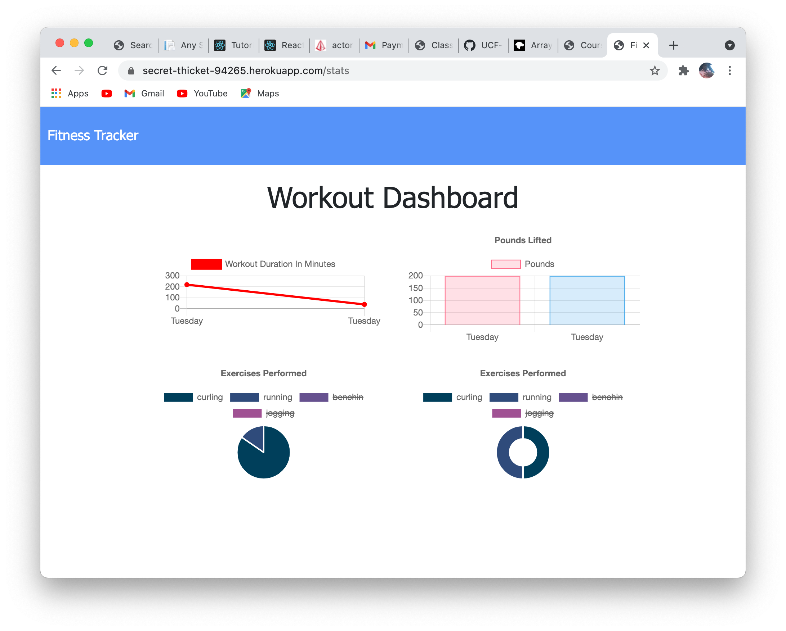

## Project Title

Workout Tracker

## Description

This is an application that creates allows the user to create, review, and update workouts. The user can choose whether their workout was a "cardio" or "resistance" workout and based on their selection add the details of their workout.

## Table of Content

1. [Installation requirements](#installation)
2. [Deployed App](#Deployed)
3. [Contributions](#contributing)
4. [screenshots](#Screenshots)
5. [License](#license)
6. [Questions](#questions)

## Installation

These are the required npm package installments needed to use create this application,
 "express", "mongoose", "morgan". 

## Deployed

 https://secret-thicket-94265.herokuapp.com/

## Contributing

I only created the backend of this application.

## Screenshots

## License

## Questions

If you have any additional questions about this project, you can find me on GitHub at DariusHay https://github.com/DariusHay, or you can email me at dariushay@gmail.com, thank you.